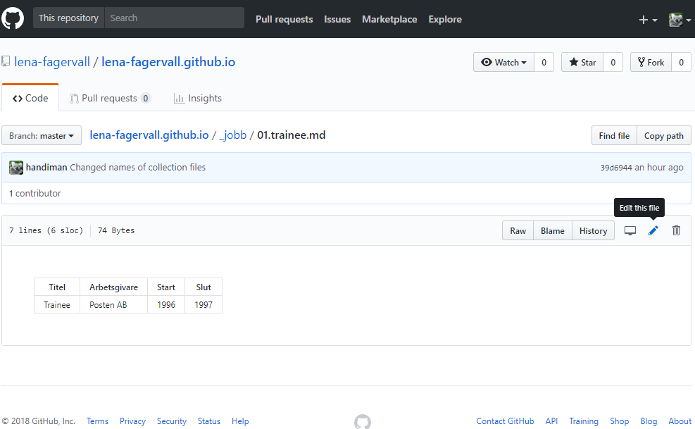
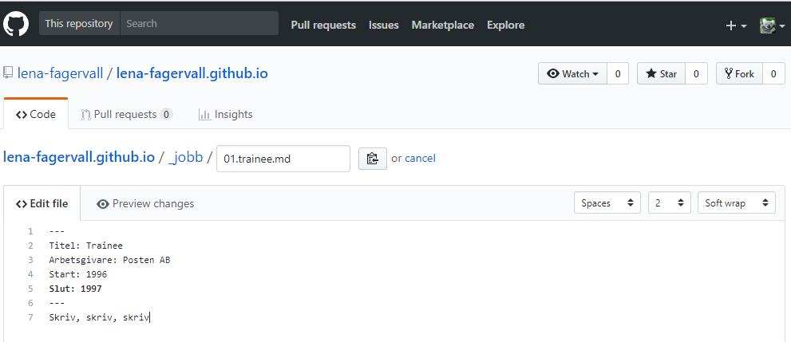
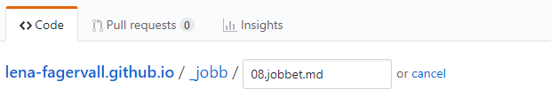
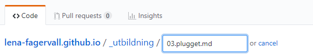

* [Ändra i en fil](#user-content-Ändra-i-en-fil)
* [Lägga till ett nytt jobb](#user-content-lägga-till-ett-nytt-jobb)
* [Lägga till en ny utbildning](#user-content-lägga-till-en-ny-utbildning)

## Ändra i en fil
1. Klicka dig fram till den fil du vill ändra i (under _data, _jobb eller _utbildning).
2. Klicka på den lilla ikonen som föreställer en penna.
   
3. Redigera.
   
4. Förhandsgranska och redigera tills du är nöjd. 
5. För att spara scrollar du ner en bit och klickar på "Commit changes".
6. Klart! Om några sekunder bör ändringarna synas på sajten.

[↑ Sidans topp](#readme)

## Sektionen Anställningar
Källan till det som visas i sektionen "Anställningar" ligger i katalogen _jobb.
Filerna är namngivna i kronologisk ordning och när de visas på sajten sorteras de i omvänd kronologisk ordning.
T ex är traineejobbet på posten döpt till *01.trainee.md* och det senaste jobbet på FMV är *07.fmv.md*.

### Lägga till ett nytt jobb
1. Klicka på knappen "Create new file".
2. Fyll i filens namn inklusive katalognamnet (_jobb/). T ex *_jobb/08.jobbet.md*.
   
3. Skriv metainformation och innehåll. T ex:

```
---
Titel: Projektledare
Arbetsgivare: Ruffel & Båg AB
Start: Jan 1930
Slut: Jan 2030
---
Det där ovan är metainformationen och här nedanför de tre strecken skriver du den lite längre beskrivningen 

Exempel på förbättringar: Allt blev bättre
```

4. Förhandsgranska och redigera tills du är nöjd. 
5. För att spara scrollar du ner en bit och klickar på "Commit changes".
6. Klart! Om några sekunder bör jobbet synas på sajten.

[↑ Sidans topp](#readme)

## Sektionen Utbildningar
Källan till det som visas i sektionen "Utbildningar" ligger i katalogen _utbildningar.
Filerna är liksom filerna i jobbkatalogen döpta i kronologisk ordning och visas på sajten i omvänd kronologisk ordning.
T ex 01.kth.md

### Lägga till en ny utbildning
Det är i stort sett samma förfarande som för jobb. 

1. Klicka på knappen "Create new file".
2. Fyll i filens namn inklusive katalognamnet (_utbildning/). T ex *_utbildning/08.plugget.md*.
   
3. Skriv metainformation. T ex:

```
---
Titel: Högskoleingenjör
År: 1991
Skola: Kungliga Tekniska Högskolan, Södertälje
Beskrivning: Maskinteknik 80 poäng
Examensarbete: Effektivisering av produktionslinje och lagerhantering 
---
Det går att skriva text här men cv:n är kodad så att den struntar i det. 
Det är för att formatteringen ska bli lika för alla utbildningar.
```

4. Förhandsgranska och redigera tills du är nöjd. 
5. För att spara scrollar du ner en bit och klickar på "Commit changes".
6. Klart! Om några sekunder bör utbildningen synas på sajten.

[↑ Sidans topp](#readme)